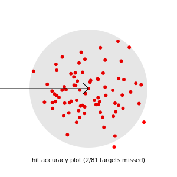

# PlotFittsTrace
 
This application generates visualisations from [GoFitts](https://www.yorku.ca/mack/FittsLawSoftware/doc/GoFitts.html) .sd3 trace data files 
(for more information see: https://www.yorku.ca/mack/FittsLawSoftware/)
  
The source code of this application is based upon the [interactive visualisation of Fitts' Law](http://simonwallner.at/ext/fitts/) by Simon Wallner:
https://github.com/SimonWallner/uit-fitts-law

The following changes have been applied to the original source code:
  * ported to node-js and d3-node for operating in the local file system
  * updated to d3 version 4
  * added a .sd3 / csv data parser to process data from GoFitts
  * applied necessary changes to accept and convert trace data in .sd3 format
  * added calculation variant for Ae/We that uses projection to task line (as applied in GoFitts Throughput class)
  * added batch processing an commandline options

  Many thanks to Scott MacKenzie for his continuous efforts on making Fitts' Law evaluations accessible to HCI researchers,
  and to Simon Wallner and Jesper Tved for providing the online visualisation tool uit-fitts-law!


## Installation

  * a current version of [node.js](https://nodejs.org/en/download) is required (v21.1 was used, older versions might work)
  * run `npm install` in the source folder
  
  
## Usage

```
node plotFittsTrace.mjs <filename.sd3> [options] 

Arguments:
  filename                     the .sd3 trace data file or directory to process

Options:
  -V, --version                output the version number
  -a, --amplitude [amplitude]  limit to trials with given amplitude (default: "0")
  -c, --captions               add axis captions (default: false)
  -d, --dwell                  include dwell time (default: false)
  -g, --group                  color-indicate trail groups in IDeff scatter plot (default: false)
  -o, --opacity [opacity]      opacity for ID scatter plots (0.5-1.0) (default: "0.8")
  -p, --smoothPos [samples]    number of samples for smoothing position plots (default: "1")
  -r, --realdistance           use real distances for De and We instead of projection to 1-dimensional task line (default: false)
  -v, --smoothVel [samples]    number of samples for smoothing velocity plots (default: "1")
  -w, --width [width]          limit to trials with given width (default: "0")
  -h, --help                   display help for command

``` 

  
## Examples

  `node plotFittsTrace.mjs myfile.sd3 -c -a=100`  processes single sd3 file, but only trials with amplitude 100, adding captions to axis 


  `node plotFittsTrace.mjs demo -p 4 -g`  processes all files in the folder demo and its subfolders, smoothing 4 samples of the position plot data, showing colored groups

The latter creates following svg images:





